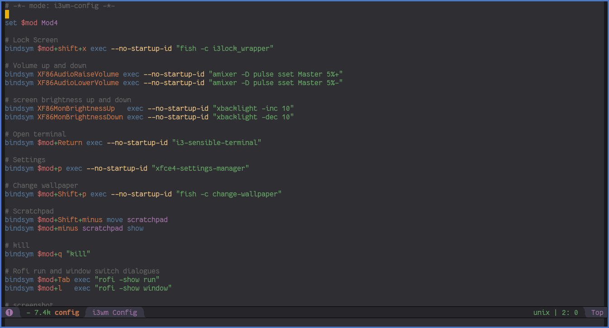

# i3wm Config Mode

An expansion of `conf-mode` to bring proper syntax highlighting to i3wm's config file:

## Features

This package builds on `conf-space-mode` (which is the major mode emacs assigns to i3wm's config file by default) and expands its
font-lock settings to provide proper syntax highlighting for the small language i3wm's config uses.
The new syntax highlighting does not define its own colors and instead directly uses emacs' own font-locking faces, making sure
that it looks good for any theme.

Features and settings outside font-locking are not touched and will be inherited from `conf-space-mode`.

## How to install

Simply install and load the package with the package manager of your choice. Additional setup is not needed.

## How to use
Place the line "`# -*- mode: i3wm-config -*-`" at the top of your i3wm config file (as seen in the first screenshot) and emacs
will automatically activate `i3wm-config-mode`.

## Known limitations
The regular expressions used here have not been tested on config files other than my own making it unlikely they will cover
all edge cases and keywords. If you find anything amiss open up an issue and I'll have it fixed.

## Todos
* `i3wm-config-mode` currently directly uses emacs' various `font-lock-*` faces, which makes customization impossible without
    redefining emacs' entire syntax highlighting theme. A future update will add proper `i3wm-config` faces which merely inherit
    emacs' font-locking settings.
* Before and after screenshots
